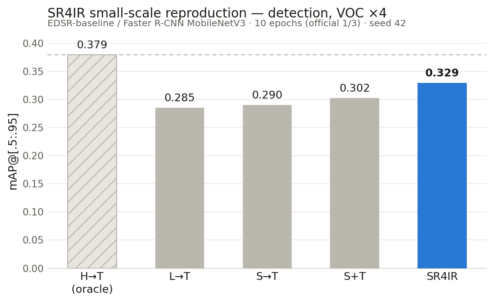
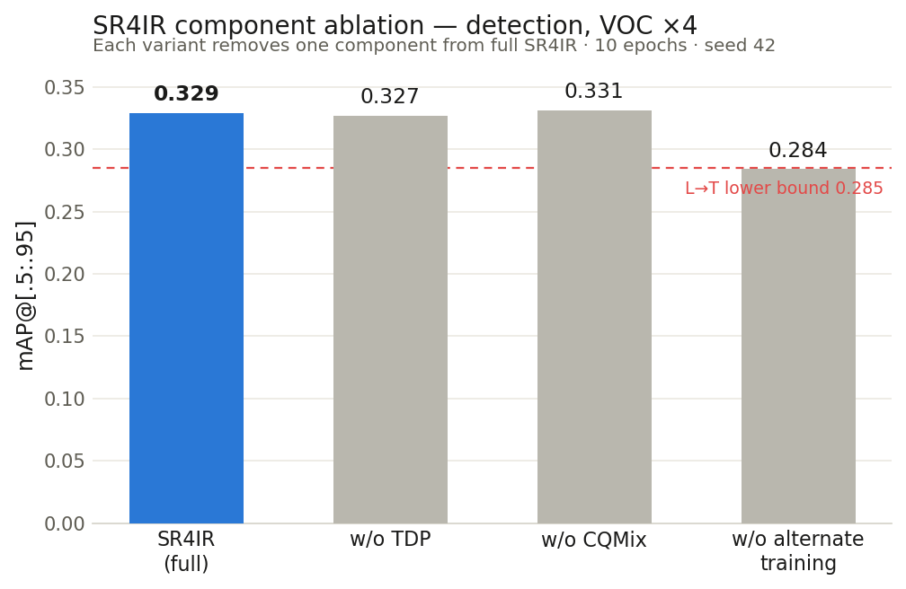
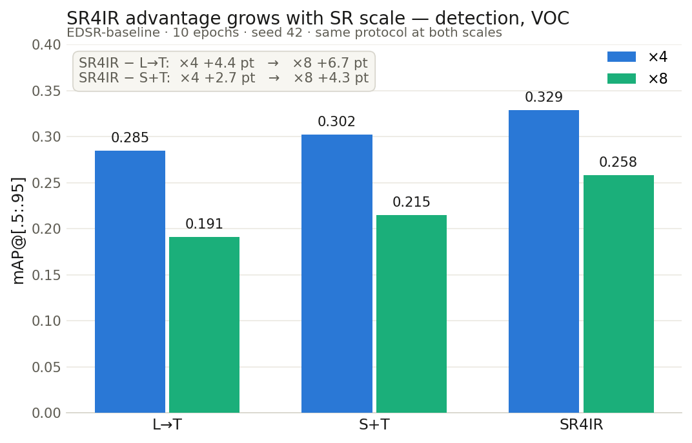

# SR4IR 复现报告(检测任务 · VOC · EDSR)

> **一句话总结**:在一台 8GB 显存的笔记本上,用官方 1/3 的训练量,三天内完整复现了
> SR4IR(CVPR 2024)在目标检测任务上的主表趋势、消融结论和倍率放大效应,
> 共 11 个训练 run,全部指标与官方结果对齐或方向一致。
>
> 时间:2026-07-03 ~ 07-05 · 硬件:RTX 4070 Laptop (8GB) · 分支:`exp/p1-mainline` / `exp/p2-ablation` / `exp/p3-x8`

---

## 1. 背景:SR4IR 是什么,为什么要复现

**问题**:低分辨率(LR)图片喂给检测器,精度会大幅下降。先超分(SR)再检测是自然思路,
但普通 SR 只追求"看起来清晰"(像素保真),恢复出来的高频细节未必是检测器需要的。

**SR4IR 的方案**:让 SR 网络向检测器"要答案"——训练时加三个组件:

| 组件 | 通俗解释 |
|---|---|
| **TDP loss**(任务驱动感知损失) | 不只要求 SR 图和高清图"像素上像",还要求它们送进检测器后的**中间特征**也像——即恢复"检测器在乎的细节" |
| **CQMix**(跨质量补丁混合) | 训练检测器时,把 SR 图和高清图随机拼成"棋盘格"喂进去,防止检测器偷懒只适应某一种画质 |
| **交替训练** | 一步只训 SR(冻结检测器),下一步只训检测器(SR 输出断开梯度),两边轮流走,避免互相拖累 |

**为什么复现**:这是我们后续自研方法(ROI 选择性超分 + 检测)的最强基线(对应
《实验清单与记录规范》阶段 0 的 S1/S2 与正式实验的 E08)。基线的数字可信,
后面所有对比才有意义。

**指标速查**:`mAP@[.5:.95]` 是 COCO 风格检测精度(越高越好,本文简称 mAP);
`mAP@50` 是宽松版;`PSNR` 衡量像素保真(越高越好);`LPIPS` 衡量感知相似度(越低越好)。

---

## 2. 环境与资源

| 项 | 值 |
|---|---|
| GPU | NVIDIA RTX 4070 Laptop,8GB 显存 |
| 软件 | Python 3.13.5,PyTorch 2.7.1+cu118,Windows 11 |
| 补装依赖 | `lpips` `ptflops` `pycocotools` `gdown` |
| 数据 | Pascal VOC2012 → COCO 格式(train 5717 / val 5823 张),按官方脚本 `preprocess/voc` + `preprocess/voc2coco` 转换 |
| 预训练 SR | DIV2K 上训好的 EDSR-baseline ×4/×8(官方 Google Drive) |
| 官方成品权重 | det ×8 全部 5 个设定 + H2T(用于 P0 管线验证) |
| 检测器 | Faster R-CNN + MobileNetV3-Large-FPN(骨干 ImageNet 初始化),21 类 |

---

## 3. 小型化改造:怎么把 48GB 显存的配置塞进 8GB

官方配置按单卡 48GB 写(batch 16)。我们对**所有训练 run** 做同一组修改,其余全部保持官方值:

| 项 | 官方 | 本复现 | 理由 |
|---|---|---|---|
| batch_size | 16 | **2** | 显存限制 |
| 梯度累积 | 无此功能 | **4 步**(等效 batch 8) | 补偿小 batch |
| AMP 混合精度 | 无此功能 | **开** | 提速省显存 |
| epoch | 30 | **10** | 控制总时长(官方 1/3) |
| 随机种子 | 100 | **42** | 统一固定 |
| num_threads | 16 | 4 | Windows DataLoader 开销 |
| 学习率/优化器/损失权重 | — | **不动** | 靠 warmup 稳住 |

**代码改动**(均为可开关的新增项,默认关闭时行为与官方逐 bit 一致):

1. `src/models/det/*.py`:AMP(`train.amp`)+ 梯度累积(`train.grad_accum`),
   四个模型(hr/lr/sr/sr4ir)的训练循环统一改造;
2. 可视化上限 `test.visualize_first_n`(默认 10):验证集是顺序采样,
   所以每个 run 的可视化样本是**同一批前 10 张**,天然可横向对比;
3. `train.alternate_training` 开关(默认 true):false 时 SR 和检测器在同一次反传里
   同步更新——专为 P2 的"去交替训练"消融加的;
4. 工具脚本:`collect_results.py`(从日志抓 mAP/PSNR/LPIPS 追加 `results.csv`)、
   `tools/make_viz.py`(可视化缩略图存 `viz/<run名>/`)。

**每个 run 的标准执行链**(5 步,全部可复制粘贴):

```bash
python src/main.py -opt options/det/p1/<run名>.yml                          # 1 训练
python src/main.py -opt options/det/p1/<run名>.yml --test_only --visualize  # 2 终测(含 LPIPS+可视化)
python collect_results.py --task det --run <run名>                          # 3 收集指标
python tools/make_viz.py --task det --run <run名>                           # 4 出缩略图
git add ... && git commit && git push                                        # 5 提交(message 带 mAP50/PSNR)
```

---

## 4. P0:管线验证——所有数字可信度的地基

**做法**:下载官方训好的 det ×8 权重,只推理不训练(`--test_only --visualize`),
看指标能否和 README 结果表**逐位对齐**。对不齐说明环境/数据/评测代码有问题,
后面训出再好的数字也不可信。

**结果:6 个设定全部逐位对齐** ✅

| 设定 | 含义 | 本机 mAP | README | 本机 LPIPS | README |
|---|---|---|---|---|---|
| H→T | 高清图直接检测(天花板) | 0.367 | 36.7 | — | — |
| L→T | LR 拉伸后直接检测(地板) | 0.189 | 18.9 | 0.559 | 0.559 |
| S→T | 先普通 SR 再检测(SR 冻结) | 0.219 | 21.9 | 0.494 | 0.494 |
| T→S | 用任务损失训 SR | 0.155 | 15.5 | 0.476 | 0.476 |
| S+T | SR 和检测器朴素联合训练 | 0.203 | 20.3 | 0.506 | 0.506 |
| **SR4IR** | 完整方法 | **0.255** | **25.5** | **0.416** | **0.416** |

单次评测(5823 张验证图 + LPIPS + 可视化)约 5-6 分钟。

---

## 5. Smoke test:先用最复杂的配置试跑 1 epoch

正式训练前,用 SR4IR(五个设定里最复杂:交替训练 + TDP + CQMix 全开)跑 1 个 epoch,
确认四件事:不爆显存、各路 loss 在降、checkpoint 能落盘、可视化能出图。

结果:峰值显存 **3.8GB**(余量充足),三路检测 loss 从 1.37 降到 0.5,
22 分钟跑完一切正常。最复杂的通了,其余设定照跑不误。

---

## 6. P1:×4 主线五连——论文主表的小规模版

五个设定同一协议各训 10 epoch,排序完全符合论文预期:

| run | 设定 | mAP@50 | mAP@[.5:.95] | PSNR | LPIPS | 训练用时 |
|---|---|---|---|---|---|---|
| 1 | H→T(天花板) | 0.659 | **0.379** | — | — | 40 min |
| 2 | L→T(地板) | 0.533 | 0.285 | 22.77 | 0.411 | 39 min |
| 3 | S→T | 0.538 | 0.290 | 20.14 | 0.424 | 62 min |
| 4 | S+T | 0.557 | 0.302 | 23.78 | 0.355 | 61 min |
| 5 | **SR4IR** | **0.583** | **0.329** | **24.00** | **0.280** | 191 min |



**怎么读**:
- **排序 H→T > SR4IR > S+T > S→T > L→T,与论文一致**;
- SR4IR 比最强朴素基线 S+T 高 **2.7 个点**,同时 PSNR、LPIPS 也全场最优——
  "任务驱动不牺牲画质还能涨点"的核心卖点成立;
- 从地板到天花板差 9.4 个点,SR4IR 收复了其中 **47%**;
- 有趣的小发现:10 epoch 的 H→T(0.379)反而略超官方 30 epoch(0.367),
  说明这个检测器在 VOC 上 10 epoch + 等效 batch 8 已基本收敛——
  我们的"1/3 训练量"方案是够用的。

**已知偏离**(记录在案,解读时注意):run3 的 SR 直接用 DIV2K 预训练权重
(官方会先在 VOC 上把 SR 微调 30 epoch),所以它的 PSNR 偏低;
只影响重建指标,不影响检测端结论。

---

## 7. P2:消融三连——拆开看每个组件值多少

基于 run5 配置**各改一处**,其余完全不动:

| 变体 | mAP@50 | mAP@[.5:.95] | Δ vs 完整版 | PSNR | LPIPS |
|---|---|---|---|---|---|
| SR4IR 完整 | 0.583 | 0.329 | — | 24.00 | 0.280 |
| 去 TDP | 0.580 | 0.327 | −0.2 pt | 24.57 | **0.339** |
| 去 CQMix | 0.589 | 0.331 | +0.2 pt | 23.90 | 0.280 |
| **去交替训练** | 0.516 | **0.284** | **−4.5 pt** | 23.99 | 0.315 |



**三个发现**:

1. **交替训练是命根子**。去掉后 mAP 精确跌回地板(0.284 ≈ L→T 的 0.285),
   SR4IR 的优势**全部**蒸发。直观原因:同步更新时 TDP 的梯度直接冲进检测器、
   而检测器又在一个不断漂移的 SR 分布上学习,1 epoch 时 mAP@50 只有 0.009
   (交替模式同期 0.189),早期就崩、后期没能爬起来。
2. **TDP 的价值主要在感知质量**。去掉它检测端只掉 0.2 个点(噪声内),
   但 LPIPS 从 0.280 恶化到 0.339(+21%),PSNR 反升 0.57dB——
   TDP 确实在"用像素保真换任务相关的高频",和论文叙事一致。
3. **诚实的局限**:TDP/CQMix 的检测端效应(±0.2 pt)在
   ×4 / 10 epoch / 单 seed 下分辨不出来。论文消融是在 ×8 / 30 epoch 做的,
   退化更重、训练更足时组件效应才放大——这正是 P3 要验证的。

---

## 8. P3:×8 趋势验证——倍率越大,SR4IR 优势越大?

只跑 L→T、S+T、SR4IR 三个点(验证趋势不需要全套),配置与 ×4 仅差
scale 和 SR 初始化权重两处:

| 设定 | ×4 mAP | ×8 mAP | ×8 官方 30ep |
|---|---|---|---|
| L→T | 0.285 | 0.191 | 0.189 |
| S+T | 0.302 | 0.215 | 0.203 |
| SR4IR | 0.329 | **0.258** | 0.255 |



**结论:成立。**
- SR4IR 对 S+T 的优势:×4 时 +2.7 pt → ×8 时 **+4.3 pt**;
- SR4IR 对 L→T 的优势:×4 时 +4.4 pt → ×8 时 **+6.7 pt**;
- 官方 30 epoch ×8 的参照值是 +5.2 / +6.6 pt——方向、量级都对上了;
- 附带验证:×8 三个点和官方几乎重合(最大偏差 1.2 pt),再次说明 1/3 训练量够用。

---

## 9. 踩坑与经验(下次复现少走弯路)

1. **先对齐再训练**。P0 逐位对齐花了不到 1 小时,却让后面 11 个 run 的数字全部可信。
   如果跳过这步,任何异常都分不清是"方法问题"还是"环境问题"。
2. **Smoke test 挑最复杂的配置**。SR4IR 通了,其余四个设定一个没炸。
3. **这套代码的断点续训对检测模型是坏的**:checkpoint 不存优化器状态,
   `resume_training()` 也不会恢复检测器权重。中途中断的 run(如 run11)
   必须**从头重跑**,不要 naive resume——我们为此多花 1 小时换来严格可比,值得。
4. **AMP + 梯度累积在 8GB 上完全够用**:全程峰值 4.8GB(同步更新消融时),
   常规训练 3.8GB,零 OOM、零 NaN,异常协议(OOM 降 batch / NaN 停报)一次没触发。
5. **固定可视化样本**。顺序采样 + 前 10 张上限,让 11 个 run 的可视化天然可以
   横向翻对比,不用另写采样逻辑。
6. **单 seed 的消融结论要留余地**:±0.2 pt 级别的差异一律当噪声处理,
   只报告方向明确、幅度显著的效应(如 −4.5 pt 的交替训练)。
7. **Git 纪律自动化**:每个 run 结束立即 commit + push(message 带指标),
   `datasets/`、`experiments/`、`*.pth` 进 .gitignore——
   三天 11 个 run 的每一步都可回溯,没有"回头补记"。

---

## 10. 工程账本

| 项 | 数字 |
|---|---|
| 训练 run | 11 个正式 + 2 个 smoke |
| 总训练时长 | 正式 run 约 19.1 h,smoke 约 0.7 h(单卡 4070 Laptop) |
| 单 run 区间 | 39 min(L→T)~ 3 h 11 min(SR4IR ×4) |
| 峰值显存 | 4.8 GB / 8 GB |
| 评测 | 17 次全量评测(P0 六次 + 11 次终测),每次 5-6 min |
| 事故 | 0 次 OOM,0 次 NaN;1 次人为中断(run11,从头重跑) |
| 产出 | `results.csv` 17 行 · 3 张结论图 · 每 run 10 张可视化 · 三条实验分支 |

## 11. 文件索引

| 路径 | 内容 |
|---|---|
| `EXPERIMENT_PLAN.md` | 完整实验计划 + 各阶段结论(P0–P3) |
| `results.csv` | 全部 17 次评测的指标记录(含 git commit 哈希) |
| `viz/p1_x4_map5095.png` | P1 五柱对比图 |
| `viz/p2_x4_ablation_map5095.png` | P2 消融对比图 |
| `viz/p3_scale_trend_map5095.png` | P3 倍率趋势图 |
| `viz/<run名>/` | 每个 run 的固定 10 张检测可视化缩略图 |
| `options/det/p0~p3/` | 全部实验配置(yml,单变量差异均写在文件头注释) |
| `collect_results.py` · `tools/make_viz.py` | 结果收集 / 可视化工具 |
| 分支 `exp/p1-mainline` / `exp/p2-ablation` / `exp/p3-x8` | 三个阶段的完整提交历史 |

---

## 12. 对后续工作的意义

- **基线就绪**:SR4IR(E08)的数字、代码、协议全部落地,自研 ROI 选择性超分(E09)
  可直接在同一协议下对比;
- **协议验证**:batch2/accum4/AMP/10ep/seed42 这套小型化协议被证明能在笔记本上
  忠实保留论文趋势——方法迭代期可以放心用它快速筛想法,最终数字再上大卡;
- **方法启示**:交替训练是任务驱动 SR 的稳定器(消融 −4.5 pt),
  自研方法若涉及 SR 与检测器联合优化,应默认继承此设计;
  TDP 类损失的收益在重退化(大倍率)场景更明显——与我们"远距离小目标"的
  论文故事天然契合。

*报告生成:2026-07-05 · 全部数据可在 `results.csv` 与各分支提交历史中核验*
